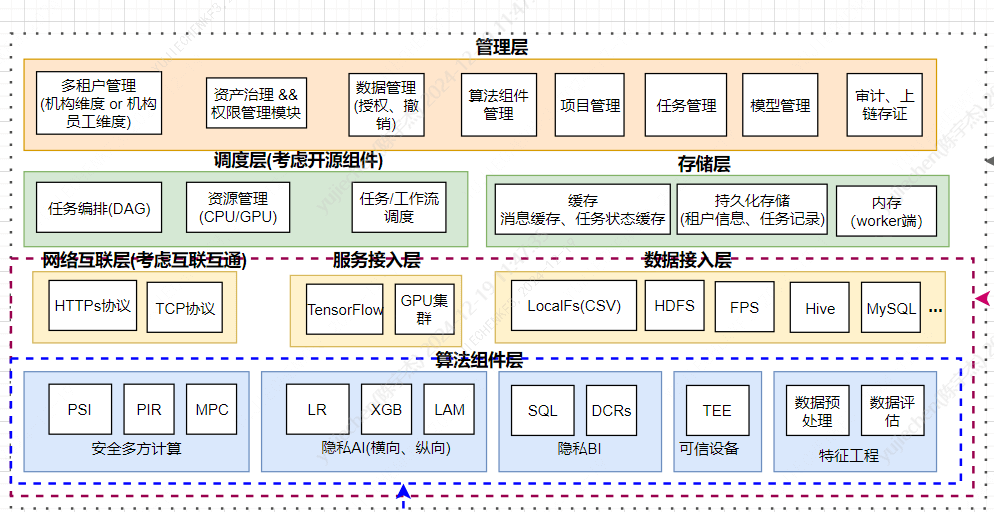

# 1. 系统架构

标签: ``WeDPR`` ``系统架构``

----

WeDPR的系统架构如下:

整个系统包括如下功能:
- 租户管理：用户组维度的用户管理 
- 数据集管理: 支持多种异构数据源接入
- 项目管理: 项目维度运行任务
- 任务管理: 管理各类隐私计算任务
- 模型管理
- 工作流（任务编排）
- 模型开发(可选): 专家模式，支持数据和模型开发人员自定义隐私任务使用流程
- 服务发布:  可将server端数据集转换为在线服务；提供在线匿踪查询功能；基于token鉴权

## 1.1 接入层

核心功能：抽象API接口，提供快速对接其他机构已有的IT体系的能力

### 1.1.1 存储接入

- 文件存储：HDFS
- 关系型数据库存储：MySQL， Oracle, Hive，其他关系型数据库

### 1.1.2 计算引擎接入

- jupyter接入
- spark(规划中): 通过jupyter lab安装pyspark，可使用单节点spark，也可接入spark集群
- tensorflow/pytorch(规划中):  多方联合建模实现考虑能否接入到各AI计算引擎

### 1.1.3 网络层接入

- 网络层互联互通：跨机构计算节点网络层互联互通

## 1.2 管理层

### 1.2.1 用户权限体系

基于用户组管理数据和服务资源的的可见、可用、可读权限。

- 可见:  可看到数据或服务资源的元信息; 经过数据或服务属主授权后，指定的机构或个人可看到他人的数据、服务元信息
- 可读： 可以读取数据或服务的具体内容； 可更新数据或服务，仅数据或服务属主可操作
- 可用: 可以使用数据或服务发起隐私计算任务

### 1.2.2 数据资源管理

当前支持的数据资源类型包括:
- 上传数据集: 托管到隐私计算平台HDFS
- 关系类型数据库: MySQL、国产数据库
- 自定义的接入HIVE数据源
- 自定义的接入HDFS数据源

### 1.2.3 跨机构资源同步

基于区块链实现跨机构的资源同步，包括: 数据集、审批信息(每行增加status字段，记录状态ID，用于支持资源增量同步)。

资源信息定义如下： 
- 资源ID(resourceID)
- 资源类型: 如数据集，服务、审批信息等
- 资源所属机构
- 资源状态(status)
- 资源描述信息: 上层模块自定义，一般推荐使用json序列化之后的字符串

### 1.2.4 审批

WeDPR中需要审批的流程包括：
- 数据集使用权限申请
- 服务使用权限申请

系统支持自定义审批模板以灵活地引入更多审批流程。审批信息通过区块链实现跨机构的流转。

### 1.2.5 专家模式

基于Jupyter + 隐私计算toolkit `wedpr-ml-toolkit`构建的一个更加灵活的开发环境；数据和模型开发者可自定义隐私计算任务流程，在不更新WeDPR隐私计算平台的前提下，实现定制化的业务需求，提升了系统的可扩展性。

## 1.3 网关

### 1.3.1 API网关

API网关的功能包括:
- 负责站点端用户登录，并基于签名和jwt token验证的方式，对访问系统的API请求进行鉴权
- 限流
- API请求路由

### 1.3.2 跨机构统一网关

负责跨机构通信，核心功能包括服务消息路由、机构内部的服务发现，并实现多语言SDK，支持不同类型语言开发的服务接入。