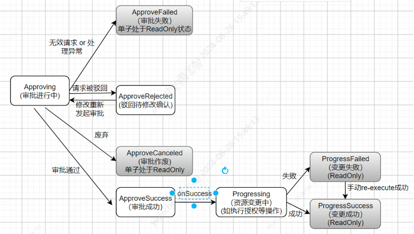

# 6.审批流

标签: ``数据同步`` ``跨机构``

----

## 6.1 背景

隐私计算平台中，对于他方资源的使用需要有申请、授权、审批的流程。审批流模块全生命周期管理资源的授权流程。
当前系统需要授权的资源主要是【数据集资源】和【服务资源】。

*******
## 6.2 功能目标

- **通用的审批流模块**：可支持不同类型的审批流程；即：有新的资源授权需要接入审批流时，可通过管理员设置表单模板直接支持，不需要修改审批模块的代码；
- **支持设置审批链**：默认是【资源属主】审批，审批链有前后依赖关系，前面的人审批后，后面的人才能看到审批单
- 审批任务状态管理
- 支持审批信息的查看，审批单的更新、废弃 
  - 仅申请人、审批链对应的人、关注人可以查看审批单
  - 仅申请人可修改、废弃审批单

*******
## 6.3 审批状态流转

审批流的状态流转如下:

