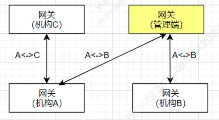
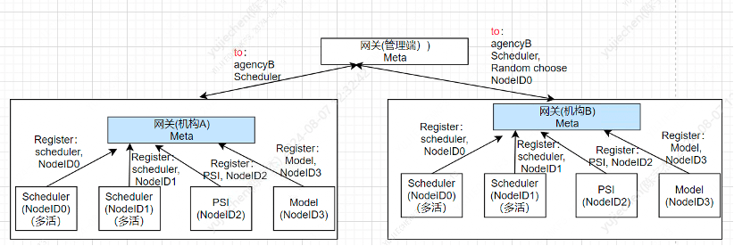
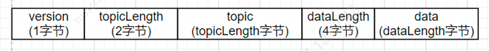
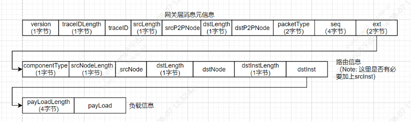

# 3. 统一网关

标签: ``网关`` ``跨机构通信``

----

## 3.1 功能目标

所有隐私计算组件均通过统一的网关进行通信。 功能包括：
- 支持基于服务的路由策略: 如消息可从机构A的调度服务路由到机构B的调度服务
- 支持基于NodeID的路由策略: 用于支持计算节点路由
- 兼容基于taskID的路由策略
Note: 基于NodeID、组件类型进行消息路由，是因为NodeID是相对比较稳定的节点标识，更适合于做基于Rip协议的最短路径网络转发；若采用基于taskID的路由方式，路由表的变更比较频繁；
- 支持双向通信协议,网关可扩展
- 支持基于最短路径网络转发（支持星形网络拓扑）
- 网关前置与网关之间采用GRPC通信协议

*******
## 3.2 系统架构

网关支持基于最短路径的路由转发策略，拓扑示例如下:





*******
## 3.3 协议设计

*******
### 3.3.1 网关前置<==>网关通信协议(GRPC)



- 这里topic是用于唯一标记通信管道的字符串，可以是任务ID，也可以是模块ID

*******
### 3.3.2 网关<==> 网关通信协议(TLS/HTTPS)



*******
## 3.4 接口

```eval_rst
.. note::
   - Java SDK接口参考 `WeDPRTransport <https://github.com/WeBankBlockchain/WeDPR-Component/blob/main/cpp/wedpr-transport/sdk-wrapper/java/bindings/src/main/java/com/webank/wedpr/sdk/jni/transport/WeDPRTransport.java>`_
   - Python SDK接口参考 `transport_api.py <https://github.com/WeBankBlockchain/WeDPR-Component/blob/main/cpp/wedpr-transport/sdk-wrapper/python/bindings/wedpr_python_gateway_sdk/transport/api/transport_api.py>`_
```


