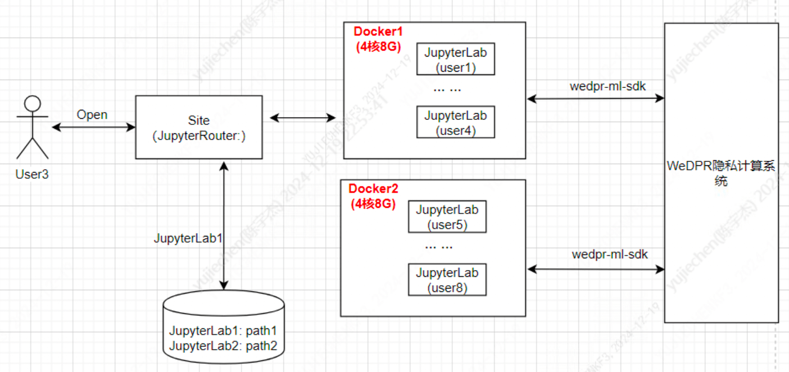

# 7. 专家模式-Jupyter管理

标签: ``Jupyter`` ``专家模式``

----

## 7.1 背景

为了满足业务用户灵活建模的需求，需要为每个用户准备一个jupyter环境。为了满足这个目标，有很多个点需要考虑。（详细在功能目标中介绍）。

*******
## 7.2 功能目标

- jupyter资源分配模式：一个用户一个jupyter（这里考虑了配比，默认配比是1个虚拟机最多可分配8个Jupyter用户）
- jupyter之间权限隔离，包括:
  - 鉴权: 实现Jupyter鉴权插件, 适配WeDPR的鉴权体系
  - 部署 && 临时数据存储: 多租户，通过linux用户体系进行多用户权限隔离

- 业务分析人员可使用jupyter交互式的方式发起隐私计算任务: 提供了专家模式SDK [wedpr-ml-toolkit](../sdk/ml_sdk/index.md).

*******
## 7.3 系统架构



```eval_rst
.. note::
   - 后续可考虑通过JupyterEnterpriseGateway接入到远端大数据集群
```

- `JupyterRouter`: 提供Jupyter多租户路由功能
- `JupyterLab`: 提供交互式分析环境
- `wedpr-ml-toolkit`: 访问隐私计算系统的SDK

*******
## 7.4 模块设计

**前端接入**
- **基础接入**：通过用户信息生成唯一链接去访问部署的jupyter服务中的前端页面，并将用户鉴权信息通过地址栏参数传递给jupyter服务
- **jupyter功能拓展**：后续如果有jupyter内其他定制化功能需求
************
**鉴权适配**
- 添加Jupyter鉴权插件`wedpr-authorization`(已上传pypip)，以适配WeDPR鉴权认证体系
- 集成JupyterHub的LocalAuthenticator对接wedpr鉴权系统

*********
**多租户Jupyter管理(JupyterRouter)**
- 用户注册时，为其在docker内默认创建用户，并在其home目录启动JupyterLab服务，作为其交互式分析的基础环境
- 站点端记录每个JupyterLab的访问入口以及用户到JupyterLab的映射
- 用户打开专家模式时，从站点端Jupyter管理模块获取并访问Jupyter入口
- Jupyter环境已默认安装了专家模式SDK `wedpr-ml-toolkit`