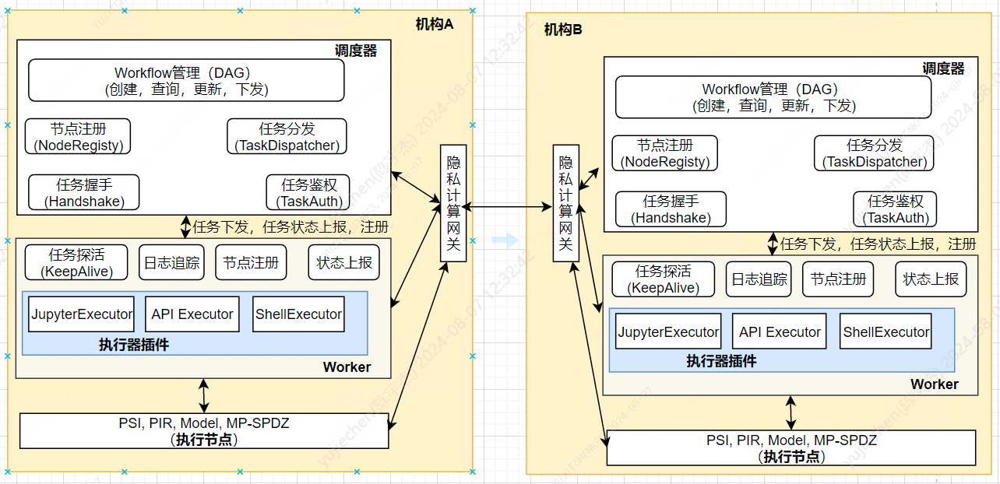

# 4. 调度模块

标签: ``WeDPR`` ``调度服务``

----

WeDPR隐私计算服务涉及多种任务，需要调度服务负责任务管理、任务调度、任务编排、任务状态跟踪。

## 4.1 功能目标

- **节点管理**： 计算节点向统一网关注册服务信息；调度服务从统一网关拉取所有正常工作的节点信息
- **任务管理**：创建、杀死任务，任务重试；任务之间可通过握手方式协调任务，从而支持多活
- **任务调度**：根据建模节点负载、节点支持的任务类型，将任务负载均衡地调度到不同计算节点，计算节点横向可扩展
- **任务编排**: 支持定义子任务之间的依赖关系，可断点重试
- **任务状态跟踪**：跟踪任务运行状态，收集任务执行日志、执行进度

****

## 4.2 系统架构

调度器(位于站点端)功能包括: 
- 任务编排
- 任务跨机构调度 && 任务管理
- 任务编排
- 任务执行结果查询

工作节点功能包括：
- 执行任务(Shell/Jupyter/Python/PSI/PIR/MPC等)
- 注册节点信息到网关
- 提供状态检查接口
- 提供日志上报接口